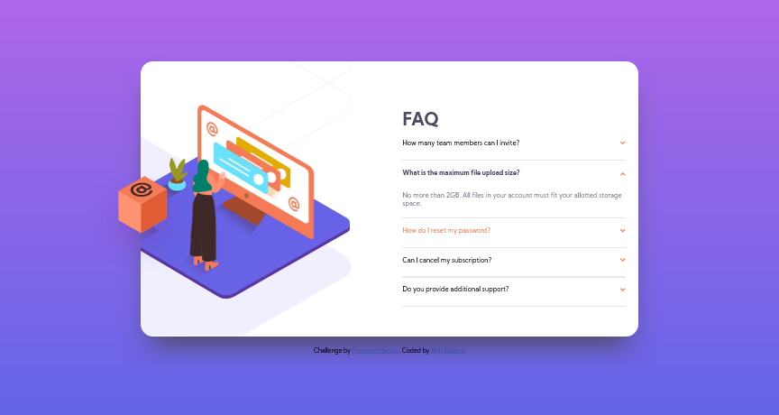

# Frontend Mentor - FAQ accordion card solution

This is a solution to the [FAQ accordion card challenge on Frontend Mentor](https://www.frontendmentor.io/challenges/faq-accordion-card-XlyjD0Oam). Frontend Mentor challenges help you improve your coding skills by building realistic projects. 

## Table of contents

- [Overview](#overview)
  - [The challenge](#the-challenge)
  - [Screenshot](#screenshot)
  - [Links](#links)
- [My process](#my-process)
  - [Built with](#built-with)
  - [What I learned](#what-i-learned)
  - [Useful resources](#useful-resources)
- [Author](#author)

## Overview

### The challenge

Users should be able to:

- View the optimal layout for the component depending on their device's screen size
- See hover states for all interactive elements on the page
- Hide/Show the answer to a question when the question is clicked

### Screenshot

### Links

- Live Site URL: [Vercel](https://faq-accordion-card-main-henna.vercel.app/)

## My process

In this challenge, I started as usual by measuring the layout, then coded the HTML script, and followed by doing the CSS styling. I started programming the JS script as soon as I finished my mobile styling. After done with Javascript, I continued to desktop styling.

### Built with

- Semantic HTML5 markup
- CSS custom properties
- Flexbox
- CSS Grid
- Mobile-first workflow
- Javascript

### What I learned

In this challenge I learned how to create an accordion feature. I also custimized by not only opening and closing one tab, but also closed the tab as I open another one. I also learned how to deal with images.

### Useful resources

- [MDN - Box-Shadow](https://developer.mozilla.org/en-US/docs/Web/CSS/box-shadow) - This article helps me understand how to use box-shadow, specifically blur-radius and spread-radius.
- [W3Schools - Gradient](https://www.w3schools.com/css/css3_gradients.asp) - This one article helps me how to make gradient background.

## Author

- Frontend Mentor - [@hattami98](https://www.frontendmentor.io/profile/hattami98)
